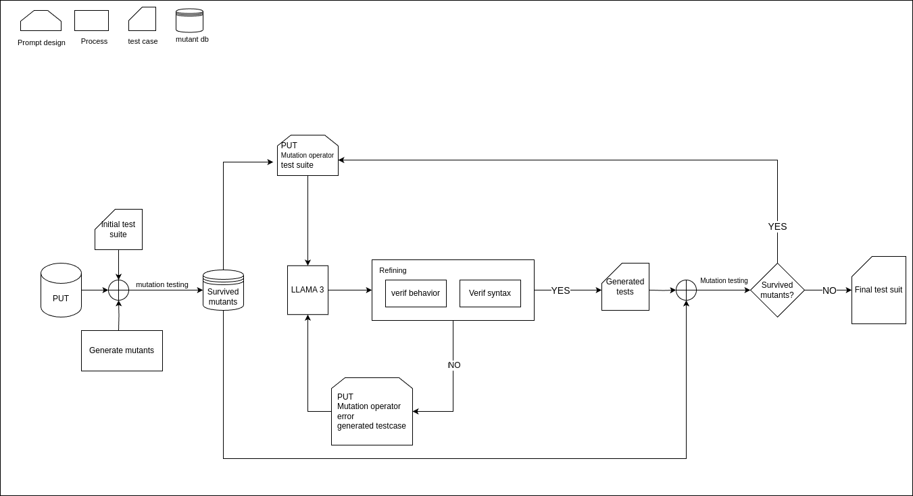

# llm-mutation-testing

## Architecture

The architecture diagram for the testcase generation tool:



**Mapping the diagram to code in `main.py`** :

The generation of prompts, sending prompts to llama 3 and refining process is defined in the function `createTest` (line 235).
To verify the behavior (the test should pass the Program Under Test) and the syntax, we execute `run_hardhat_test` (line 305) in the function `runTest` (line 318). 
We then check the created awesome-report to extract  execution errors if any. We use those errors to reprompt the tescase in order to crrect it. The errors are saved to `dataset_code.csv`.
We repeat the reprompting process LOOP_SIZE times to generate a testcase that compiles correctly and pass the PUT. The correct test are copied to corrected_tests folder, the incorrect tests are placed in error_tests folder and the used prompts are saved in generated_prompts.  

## Getting started

For this project, we are using hardhat v2.22.6. In a first step we need to set up the hardhat project.
We use the web3_music project as template project

### Prerequist - Set up the solidity project project
Set up your project: 

1- Install dependencies 

2- Intall mochaawsome

3- Install solidity-coverage

4- Install sumo 

Here, we take an example of the web3_music project located in `case_studies/web3_music`

```bash
cd case_studies/web3_music
nvm use 18
yarn install
yarn compile
npx hardhat test
```
Install mochawsome ```npm install mochawesome --save-dev```

Install solidity-coverage  ```npm i solidity-coverage``` or ```yarn add solidity-coverage --dev```

Install sumo on your hardhat project ```npm install @morenabarboni/sumo```


Before using SuMo you must specify your desired configuration in a [sumo-config.js](https://github.com/MorenaBarboni/SuMo-SOlidity-MUtator/blob/master/src/sumo-config.js) in the root directory of the project. The ```sumo-config.js``` is automatically generated upon installation.
)

Here's a simple example of ```sumo-config.js```:

```
module.exports = {
  buildDir: 'artifacts',
  contractsDir: 'contracts',
  testDir: 'test',
  skipContracts: [],
  skipTests: [],
  testingTimeOutInSec: 300,
  network: "none",
  testingFramework: "hardhat",
  minimal: false,
  tce: false
}
```


Update ```hardhat-config.js``` to add **mochawesome** in `config`.

```
const config: HardhatUserConfig = {
  solidity: {
    version: "0.8.16",
    settings: {
      optimizer: {
        enabled: true,
        runs: 1000,
      },
    },
  },
  mocha: {
    reporter: 'mochawesome',
    reporterOptions: {
      reportFilename: 'test-results', // Customize the report filename
      quiet: false,
      json: true,
      html: false // Set to false if you don't want HTML output
    }
  },
....
```
run mutation testing : 
```
npx sumo mutate

npx sumo test
```
This operation can take a lot of time, instead, we have run the mutation testing for the project case_studies/web3_music. The results are in the folder case_studies/web3_music/web3_sumo_results.


In the main directory of the project You should copy the mutation results to sumo folder :
```
cd ../../
rm -r ./case_studies/web3_music/sumo

cp -r ./case_studies/web3_music/web3_sumo_results ./case_studies/web3_music/sumo
```
# Generating testcases
**Configuring Environment Variables**

Create .env file : ```touch .env```
Add environment variable :
```
LOOP_SIZE = '3'
MUTANT_NBRE = '5'
```
LOOP_SIZE: the umber of trials of sending the prompt containing the wrong testcase with the error
MUTANT_NBRE: the number of mutant we are going to genertae tests for.


### 1- Create Dataset
This dataset contains the contract code with the mutation operation and the mutation status and other relevant data extracted from sumo/results/results.csv.
For this project, web3_music, we have already run the mutation testing, the results are in the folder aws-sumo-testResults

Create csv file for the dataset : 
```
python3 main.py --create_dataset path_to_project
```
Example :
```
python3 main.py --create_dataset  ./case_studies/web3_music
```

### 2- Add the project tests (exisiting tests) to dataset

```
python3 main.py --add_initial_tests path_to_project
```
Example : 
```
python3 main.py --add_initial_tests ./case_studies/web3_music
```

### 3- Generate new test cases using LLM

Generate test case for each mutant that survived the initial mutation testing :
You can change the number of mutants to genertae test for by changing the environment variable 'MUTANT_NBRE'  in .env
You can change the size of the loop size (the maximum number of trials to prompt the error with testcase) by changing the he environment variable 'LOOP_SIZE' in .env
```
python3 main.py --launch_experiment path_to_project

```
Example :
```
python3 main.py --launch_experiment ./case_studies/web3_music
```
