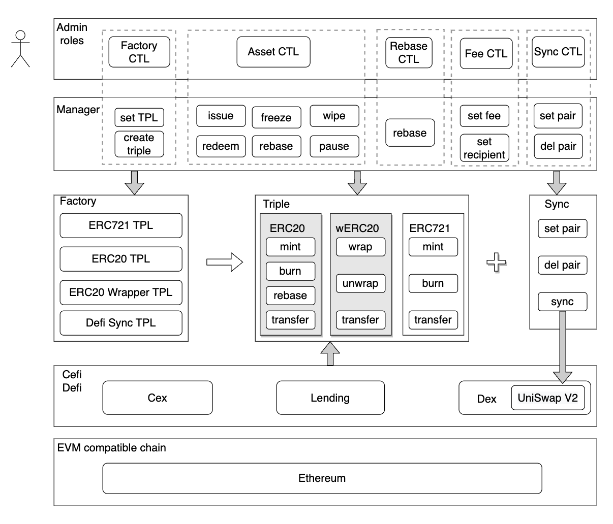

# Allobase

## Contract Specification

Allobase is tokenization service platform.
Tokenization service refers to the process of transforming Real World Assets (RWA) into digital tokens on the blockchain. These digital tokens represent ownership of the underlying assets.

The Allobase tokenization service offers a comprehensive platform for users to convert the value of their assets into tokens.

The platform consists of several contracts, including the Manager Contract, Factory Contract, ERC-20 Template Contract with rebase mechanism, ERC-721 Template Contract, ERC-20 Wrapper Template Contract, and Sync Template Contract.

### Contract structure


### Contracts
* [Manager Contract](./contracts/Manager.sol)

    The Manager contract is the main contract that serves as the gateway for all management operations on our platform. It is controlled by a group of controllers who have multi-signature access. This contract interacts with the Factory contract to create new triples (calls createTriple() function) and manages the issuance and redemption of ERC-20 and ERC-721 tokens and changes contract ownership, and so on.

* [Factory Contract](./contracts/Factory.sol)

    The Factory contract is responsible for creating new Triples, which consist of an ERC-20 token, an ERC-20 Wrapper token, and an ERC-721 token. The Factory contract is called by the Manager contract to create new Triples.

* [ERC-20 Template Contract (with rebase mechanism)](./contracts/templates/ERC20Tpl.sol)

    The ERC-20 Template Contract is a ERC-20 token contract that is used as a template for the creation of new ERC-20 token contracts. Those contracts with a rebase mechanism and rebase every 8 hours. Tokens issued by those contracts to users also represent users holding the corresponding underlying RWA assets.

* [ERC-721 Template Contract](./contracts/templates/ERC721Tpl.sol)

    The ERC-721 Template Contract is a standard ERC-721 token contract that is used as a template for the creation of new ERC-721 tokens contracts. NFTs issued by those contracts that represent the authenticity and traceability of the underlying RWA assets. The NFTs are locked in the corresponding ERC-20 contract addresses out of circulation.

* [ERC-20 Wrapper Template Contract](./contracts/templates/ERC20WrapperTpl.sol)

    The ERC-20 Wrapper Template Contract is a standard ERC-20 token contract that is used as a template for the creation of new ERC-20 Wrapper tokens contracts. Users can wrap their rebase tokens to circulate on CeFi/DeFi platforms that are not compatible with rebase tokens.

* [Sync Template Contract](./contracts/templates/SyncTpl.sol)

    The Sync Template Contract is used to call the UniswapV2 Pair sync() function. This function is used to force the reserves to match the balances, which helps to prevent price slippage and keep data consistency on DEXs.

These contracts work together to manage Real World Assets (RWAs) on the blockchain, a Triple consisting of an ERC-20 contract, an ERC-20 Wrapper contract, and an ERC-721 contract. The RWA tokenization process involves creating NFTs which represent the authenticity and traceability of the underlying assets, locking the NFTs in the corresponding ERC-20 contract address, and issuing ERC-20 tokens to users. The RWA redemption process involves redeeming ERC-20 tokens for the underlying assets represented by the NFTs, and then burning both the ERC-20 tokens and the NFTs.

### Contract addresses

* Goerli:
* Mainnet:

## Getting started

### Installation

```bash
npm install
npx hardhat compile
npx hardhat test
```

You can also run ```npx hardhat coverage ``` to see a coverage report.

### Deployment

* Deploy templates: ERC-20, ERC-20 Wrapper, ERC-721, Sync
    ```bash
    npx hardhat run --network <network-name> scripts/1.deployTpls.js
    ```    

* Deploy Factory
    ```bash
    npx hardhat run --network <network-name> scripts/2.deployFactory.js
    ```    

* Deploy Manager
    ```bash
    npx hardhat run --network <network-name> scripts/3.deployManager.js
    ```     

* Init Factory
    ```bash
    npx hardhat run --network <network-name> scripts/4.initFactory.js
    ```  

* Init Manager
    ```bash
    npx hardhat run --network <network-name> scripts/5.initManager.js
    ```      

## Usages

### CreateTriple

```solidity
function createTriple(string name, string symbol, string underlyingUnit) external returns (struct IFactory.triple t, address s)
```

Create a new triple in the Manager contract

_Must be called by the current factory controller_

#### Parameters

| Name | Type | Description |
| ---- | ---- | ----------- |
| name | string | The ERC20 token name |
| symbol | string | The ERC20 token symbol |
| underlyingUnit | string | The unit of underlying amount, eg `KG`, `OZ` |

#### Return Values

| Name | Type | Description |
| ---- | ---- | ----------- |
| t | struct IFactory.triple | The ERC-721/ERC-20/ERC-20 Wrapper address triple |
| s | address | The address of the Sync contract |

#### Examples

```solidity
createTriple("Allobase Gold Token", "AGT", "OZ")
```
then a new Triple generated: 
| Name | Description |
| ---- | ----------- |
| AGT | The ERC-20 token |
| wAGT | The ERC-20 wrapper token |
| AGT NFT | The ERC-721 token |

### Tokenization

The tokenization process works as follows:

* The asset controller calls the issue function of the Manager contract, which initiates the tokenization process.

* The Manager contract calls the ERC-721 contract's issue function to issue NFTs representing the authenticity and traceability of the underlying assets.

* The Manager contract locks the NFTs in the ERC-20 contract address. This ensures that the ERC-20 tokens issued to users are always backed by the underlying asset represented by the NFTs.

* The Manager contract calls the ERC-20 contract's issue function to issue ERC-20 tokens to the user address. These tokens represent the ownership of the underlying asset.

* A issuance fee is charged based on the corresponding fee rate, which is deducted from the ERC-20 tokens issued. The fee is transferred to the issuance fee address and the rest of the tokens will be transferred to user addresses.


```solidity
function issueTo(string symbol, address toAddr, uint256 issueFeeRate, string[] tokenURIs, uint256[] erc20Amounts) external
```

Issues ERC-721 and ERC-20 token for a given symbol in the Manager contract

_Must be called by the current asset controller_

#### Parameters

| Name | Type | Description |
| ---- | ---- | ----------- |
| symbol | string | The ERC-20 token symbol |
| toAddr | address | The receive address |
| issueFeeRate | uint256 | The issue fee rate |
| tokenURIs | string[] | The ERC-721 tokenURIs |
| erc20Amounts | uint256[] | The ERC-20 token amounts |

### Redemption

The redemption process works as follows:

* To perform the redemption process, users first need to select the assets they want to redeem which are associated with specific NFTs, and then sign for the redemption data. They also need to ensure that they have a sufficient balance of the corresponding ERC-20 tokens to cover the asset value (in kg/oz weight) and the redemption fee, that is, the balance >= asset value + redemption fee.

* The asset controller initiates the redemption process by calling the redeem function of the Manager contract.

* The Manager contract collects the redemption fee and transfers it to our redemption fee address, and then calls the ERC-20 contract to burn the corresponding amount of ERC-20 tokens from the redeem controller address.

* Because all NFTs were locked in the ERC-20 contract addresses when tokenization, so the ERC-20 contract then calls the redeem function of the ERC-721 contract to burn the corrspending NFTs, passing in the ID of the corresponding NFTs.

* The ERC-721 contract verifies that the caller is the ERC-20 contract and burns the corresponding NFTs, which represent the underlying assets.

```solidity
function redeemFrom(string symbol, address fromAddr, uint256 redeemFeeRate, uint256[2] amount, uint256[2] deadline, uint8[2] v, bytes32[4] rs, uint256[] erc721TokenIds) external
```

Redeems ERC-721 and ERC-20 token for a given symbol in the Manager contract

_Must be called by the current asset controller_

#### Parameters

| Name | Type | Description |
| ---- | ---- | ----------- |
| symbol | string | The ERC-20 token symbol |
| fromAddr | address | The address that redeem from |
| redeemFeeRate | uint256 | The redeem fee rate |
| amount | uint256[2] | The permit and redemption ERC-20 token amount |
| deadline | uint256[2] | The permit and redemption deadline |
| v | uint8[2] | The permit and redemption signature v |
| rs | bytes32[4] | The permit and redemption signature r/s |
| erc721TokenIds | uint256[] | The ERC-721 tokenIds |


For more detail documentation, please refer to [here](./docs).

## Bug bounty

We encourage reporting security vulnerabilities in this repository.

If you believe you have discovered a security vulnerability, please refer to [the bug-bounty page](https://www.allobase.com/company/bug-bounty) and get in touch via security@allobase.com.

## LICENSE

This project is licensed under the [GNU General Public License v3.0](./LICENSE).